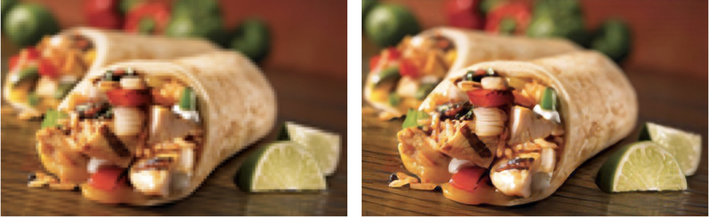

[](https://travis-ci.com/IBM/MAX-Image-Super-Resolution-Generator) 

# IBM Developer Model Asset Exchange: Image Super-Resolution Generator

This repository contains code to instantiate and deploy an image super-resolution generator. 
This model is able to upscale a pixelated image by factor 4x, while generating photo-realistic details.

The GAN is based on [this GitHub repository](https://github.com/brade31919/SRGAN-tensorflow) and the following research article:

[Photo-Realistic Single Image Super-Resolution Using a Generative Adversarial Network](https://arxiv.org/pdf/1609.04802.pdf)

The model was trained on 600,000 images of the [OpenImages V4](https://storage.googleapis.com/openimages/web/index.html) dataset, and the model files are hosted on
[IBM Cloud Object Storage](http://max-assets.s3-api.us-geo.objectstorage.softlayer.net/max-image-super-resolution-generator/v1.0.0/assets.tar.gz).
The code in this repository deploys the model as a web service in a Docker container. This repository was developed
as part of the [IBM Developer Model Asset Exchange](https://developer.ibm.com/exchanges/models/).

## Model Metadata
| Domain | Application | Industry  | Framework | Training Data | Input Data Format |
| ------------- | --------  | -------- | --------- | --------- | -------------- | 
| Vision | Super-Resolution | General | TensorFlow | [OpenImages V4](https://storage.googleapis.com/openimages/web/index.html) | Image (RGB/HWC) |

## Benchmark

| Set5 | Author's SRGAN | This SRGAN |
| -------- | ------------------ | ----------- |
| PSNR | 29.40 | 29.56 |
| SSIM | 0.85 | 0.85 |

| Set14 | Author's SRGAN | This SRGAN |
| -------- | ------------------ | ----------- |
| PSNR | 26.02 | 26.25 |
| SSIM | 0.74 | 0.72 |

| BSD100 | Author's SRGAN | This SRGAN |
| -------- | ------------------ | ----------- |
| PSNR | 25.16 | 24.4 |
| SSIM | 0.67  |  0.67 |

The performance of this implementation was evaluated on three datasets: Set5, Set14, and BSD100.
The PSNR (peak signal to noise ratio) and SSIM (structural similarity index) metrics were evaluated, although the paper discusses
the MOS (mean opinion score) as the most favorable metric. In essence, the SRGAN implementation trades a better PSNR or SSIM score for a result more appealing to the human eye. This leads to a collection of output images with more crisp and realistic details.


_NOTE: The SRGAN in the paper was trained on 350k ImageNet samples, whereas this SRGAN was trained on 600k [OpenImages V4](https://storage.googleapis.com/openimages/web/index.html) pictures._

## References

* _C. Ledig, L. Theis, F. Huszar, J. Caballero, A. Cunningham, A. Acosta, A. Aitken, A. Tejani, J. Totz, Z. Wang, W. Shi_, [Photo-Realistic Single Image Super-Resolution Using a Generative Adversarial Network](https://arxiv.org/pdf/1609.04802.pdf), ArXiv, 2017.
* [SRGAN-tensorflow (model code source)](https://github.com/brade31919/SRGAN-tensorflow)
* [tensorflow-SRGAN](https://github.com/trevor-m/tensorflow-SRGAN)
* [Deconvolution and Checkerboard Artefacts](https://distill.pub/2016/deconv-checkerboard/)

## Licenses

| Component | License | Link  |
| ------------- | --------  | -------- |
| This repository | [Apache 2.0](https://www.apache.org/licenses/LICENSE-2.0) | [LICENSE](https://github.com/IBM/MAX-Image-Super-Resolution-Generator/blob/master/LICENSE) |
| Model Weights | [Apache 2.0](https://www.apache.org/licenses/LICENSE-2.0) | [LICENSE](https://github.com/IBM/MAX-Image-Super-Resolution-Generator/blob/master/LICENSE) |
| Model Code (3rd party) | [MIT](https://opensource.org/licenses/MIT) | [LICENSE](https://github.com/brade31919/SRGAN-tensorflow/blob/master/LICENSE.txt) |
| Test assets | [CC BY 2.0](https://creativecommons.org/licenses/by/2.0/) | [Asset README](assets/README.md) |
|  | [CC0](https://creativecommons.org/publicdomain/zero/1.0/) | [Asset README](assets/README.md) |

## Pre-requisites:

* `docker`: The [Docker](https://www.docker.com/) command-line interface. Follow the [installation instructions](https://docs.docker.com/install/) for your system.
* The minimum recommended resources for this model is 8 GB Memory (see Troubleshooting) and 4 CPUs.

# Steps

1. [Deploy from Docker Hub](#deploy-from-docker-hub)
2. [Deploy on Kubernetes](#deploy-on-kubernetes)
3. [Run Locally](#run-locally)

## Deploy from Docker Hub

To run the docker image, which automatically starts the model serving API, run:

```
$ docker run -it -p 5000:5000 codait/max-image-super-resolution-generator
```

This will pull a pre-built image from Docker Hub (or use an existing image if already cached locally) and run it.
If you'd rather checkout and build the model locally you can follow the [run locally](#run-locally) steps below.

## Deploy on Kubernetes

You can also deploy the model on Kubernetes using the latest docker image on Docker Hub.

On your Kubernetes cluster, run the following commands:

```
$ kubectl apply -f https://github.com/IBM/MAX-Image-Super-Resolution-Generator/raw/master/max-image-super-resolution-generator.yaml
```

The model will be available internally at port `5000`, but can also be accessed externally through the `NodePort`.

## Run Locally

1. [Build the Model](#1-build-the-model)
2. [Deploy the Model](#2-deploy-the-model)
3. [Use the Model](#3-use-the-model)
4. [Development](#4-development)
5. [Cleanup](#5-cleanup)


### 1. Build the Model

Clone this repository locally. In a terminal, run the following command:

```
$ git clone https://github.com/IBM/MAX-Image-Super-Resolution-Generator.git
```

Change directory into the repository base folder:

```
$ cd MAX-Image-Super-Resolution-Generator
```

To build the docker image locally, run: 

```
$ docker build -t max-image-super-resolution-generator .
```

All required model assets will be downloaded during the build process. _Note_ that currently this docker image is CPU only (we will add support for GPU images later).


### 2. Deploy the Model

To run the docker image, which automatically starts the model serving API, run:

```
$ docker run -it -p 5000:5000 max-image-super-resolution-generator
```

### 3. Use the Model

The API server automatically generates an interactive Swagger documentation page. Go to `http://localhost:5000` to load it. From there you can explore the API and also create test requests.

Use the `model/predict` endpoint to load a test image (you can use one of the test images from the `assets/test_examples/low_resolution` folder) in order to get a high resolution output image returned.

The ideal input image is a PNG file with a resolution between 100x100 and 500x500, preferably without any post-capture processing and flashy colors. The model is able to generate details from a pixelated image (low DPI), but is not able to correct a 'blurred' image.


_Left: input image (106×159). Right: output image (424×636)_


You can also test it on the command line, for example:

```
$ curl -F "image=@assets/test_examples/low_resolution/airplane.png" -XPOST http://localhost:5000/model/predict > airplane_high_res.png
```

The above command will send the low resolution `airplane.png` file to the model, and save the high resolution output image to the `airplane_high_res.png` file in the root directory.

### 4. Development

To run the Flask API app in debug mode, edit `config.py` to set `DEBUG = True` under the application settings. You will then need to rebuild the docker image (see [step 1](#1-build-the-model)).

Please remember to set `DEBUG = False` when running the model in production. 

### 5. Cleanup

To stop the Docker container, type `CTRL` + `C` in your terminal.

# Troubleshooting
- Calling the ```model/predict``` endpoint kills the Docker container with the message ```Killed```
> This is likely caused due to the default limitation of Docker's memory allocation to 2 GB. Navigate to the ```Preferences``` menu under the Docker Desktop application. Use the slider to increase the available memory to 8 GB and restart Docker Desktop.

- The details in the output image are different than what may be expected and are sometimes not physically possible
> This model generates details basically 'out of thin air'. Creating something out of nothing is not possible without making assumptions.
The network attempts to recognize elements in the low-resolution image from which it can infer what the reality (human eye | super-resolution) could have looked like. If a group of pixels strongly resembles an observation that is not related to the content of the image, it might lead to observing results that are not 'physically possible'. 

>For example: a white pixel in a low-resolution image might have been converted to a snowflake, although the original picture might have been taken in the desert. This example is imaginary and has not actually been observed.

- Artefacts in the output image
> Observing artefacts in some images is unfortunately inevitable as any neural network is subject to technical limitations and characteristics of the training data.

> Keep in mind that the best results are achieved with the following:
> * A PNG image
> * An image that is sufficiently zoomed in. During the process, the network groups a block of pixels together. If the block contains more details than the network produces, the result will be spurious.
> * An image taken under natural light, without filters, and with few bright or flashy colors. The neural network was not trained on heavily edited images.
> * An image that has sufficiently high resolution to not confuse the network with multiple possibilities (e.g. a sole pixel in a very low-resolution image could represent an entire car, person, sandwich,..)
> * The model is able to generate details from a pixelated image (low DPI), but is not able to correct a 'blurred' image.
